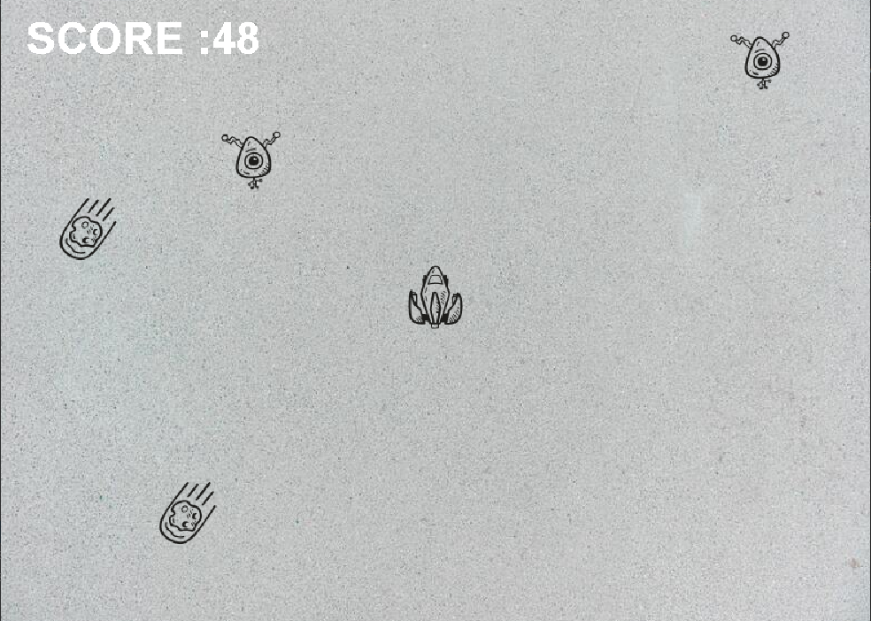

# 운석피하기
진행기간 : 2022.04.16 ~ 2022.05.07

## 프로젝트 소개
player가 무작위 위치에서 생성되는 운석과 외계인을 피하는 게임

## 패키지 구조

## 프로젝트 주요 기능
Class AvoidMeteor : 화면 출력 담당
Class GamePlay : 게임 실행 담당(스레드로 구현) / 플레이어를 생성한다.
                 / 일정 시간이 지나면, 운석과 외계인을 생성(alienAppearProcess() 메소드, meteorAppearProcess() 메소드)하고 움직(meteorMoveProcess() 메소드, alienMoveProcess() 메소드)이며, 충돌 판정(crashCheckMeteor() 메소드, crashCheckAlien() 메소드)을 하는 역할

## 클래스 설계도

## !프로젝트 이슈
문제점 : 운석과 외계인이 생성되어 플레이어를 공격하는데,
먼저 생성된 운석과 외계인은 새로운 운석과 외계인이 생성되는 즉시 플레이어 공격 기능이 사라지게 되는 문제점 발생

해결법 : for문을 통해서, 생성되어 있는 전 운석 및 외계인 객체들에 대해 충돌 체크를 하도록 코드를 수정

## 시연사진

## 시연영상

## 추후 코드 개선점
게임 플레이 후 플레이어 사망 시, enter를 눌러도 재시작이 안되는 문제 개선 필요,
(재시작을 하게 되면, 새로운 스레드가 생성되나, 화면이 다시 그려지지 않는 문제 개선 필요)

플레이어 공격 기능 추가

플레이어 hp 표시 기능 추가

##프로젝트 회고
스레드를 사용하면서, 스레드를 어떻게 사용해야 적절하게 사용할 수 있는가에 대한 고민을 해보았습니다.
다음 프로젝트를 진행하면서, 스레드 사용법에 대해 조금 더 익혀서, 현재 프로젝트를 수정할 계획입니다.

## 느낀점
단순한 게임을 만든다는 생각을 하고 시작한 프로젝트였는데, 많은 부분에 막히는 점이 많았습니다.
스레드나 JFrame에 대한 개념에 대해 이해를 하지 못하고, 쫒기듯 코드를 짜다보니, 아웃풋이 아쉽습니다.
추후 프로젝트를 진행할 때에는 사용해야할 개념에 대해 확실히 숙지하고, 코드를 작성할 생각입니다.

## 저작권
배경음악 : https://www.bensound.com/royalty-free-music/track/sci-fi / Music: www.bensound.com
폭발음 : https://freesound.org/people/derplayer/sounds/587174/